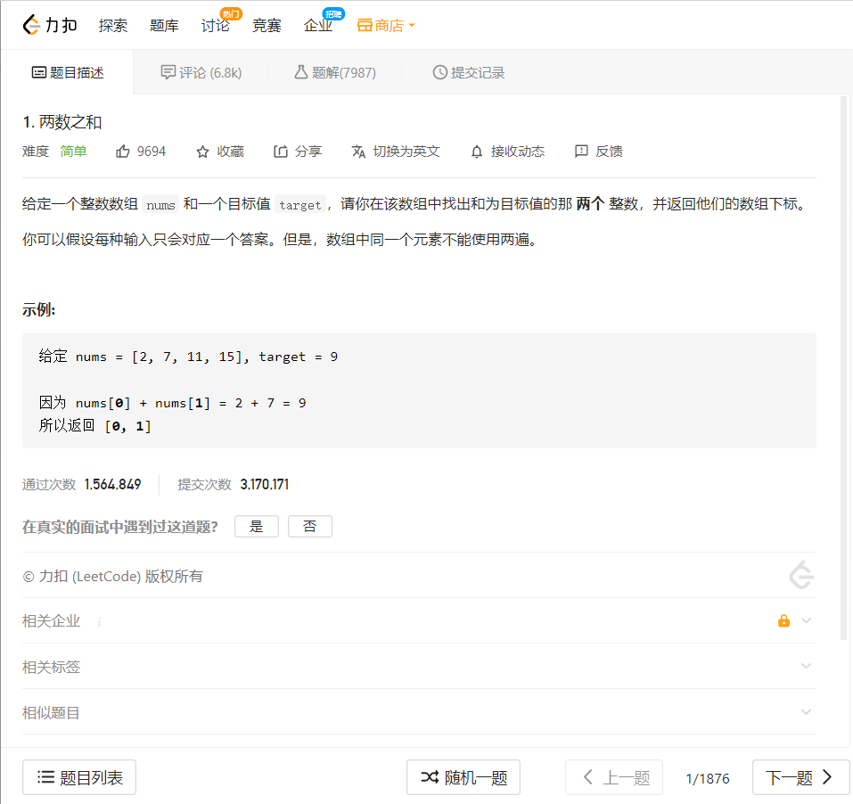

# LeetCode
​		总是看知乎CSDN推荐别人去刷LeetCode，一直觉得这种东西离我还比较远，觉得自己技术还不行，但今天看到了一篇文章，写的是一个本科CS学生的日常，其中答主就是经常性的写博客和刷题，对我还是挺触动的，所有这是我的第一篇关于LeetCode的文章，希望能坚持下去。

## 第一题

### 题目



### 解题

**思路：**

1. 将数组转换为ArrayList<Integer> integers
2. integers进行升序排序得到新的integers
3. 把相加的两个数看做是两个游标，分别为游标a和游标b
4. 程序开始前，游标a在integers的头部，游标b在integers的尾部
5. a+b>target，b向左移，a+b变小；a+b<target，a向右移，a+b变大
6. 最后游标的位置为想要的数！

```java
import java.util.ArrayList;
import java.util.Collections;

public class LeetCodeTest {
    public static void main(String[] args) {
        int nums[] = new int[]{3,2,3};
        System.out.println("nums的长度 "+nums.length);

        System.out.println("-----分割------");

        int[] ints = twoSum(nums, 6);
        for (int a: ints) {
            System.out.print(" "+a);
        }
    }
//解题
    public static int[] twoSum(int[] nums, int target) {
        //定义2个动态数组,一个用来排序，一个用来最后算位置
        ArrayList<Integer> integers = new ArrayList<Integer>();
        ArrayList<Integer> integers2 = new ArrayList<Integer>();
        for (int a: nums) {
            integers.add(a);
            integers2.add(a);
        }
        System.out.println("integers："+integers);
        Collections.sort(integers);
        System.out.println("integers："+integers);
        //定义一个的处理后的集合
        ArrayList<Integer> ends = new ArrayList<Integer>();
        int j = integers.size()-1;
        for(int i=0;i<integers.size()&&i<j;){
            if(integers.get(i) + integers.get(j) < target){
                i++;
            }else if (integers.get(i) + integers.get(j) > target){
                j--;
            }else if (integers.get(i) + integers.get(j) == target){
                ends.add(integers.get(i));
                ends.add(integers.get(j));
                i++;
                j--;
            }
        }
        System.out.println("ends:"+ends);
        int nums2[] = new int[ends.size()];
        int i = 0;
        for (int a : ends) {

            nums2[i] = integers2.indexOf(a);
            integers2.set(nums2[i],null);
            i++;
        }
        return nums2;
    }

}
```

### 结果


